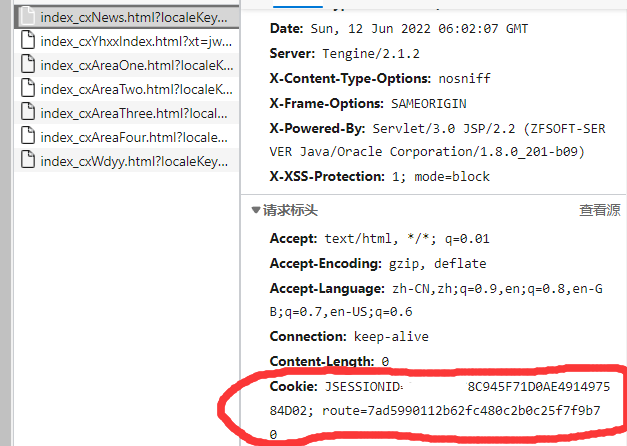
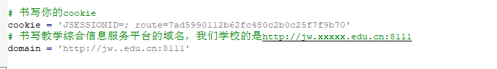

软件介绍
----
- 作用：方正教务系统查任意学号成绩

目录结构
----

- main.py
  - 主程序，在里面改两个变量
- pdfToExcel
  - 将pdf转换为excel文件

使用教程
----
1. 首先确保你的教务系统和我的一样

2.  打开F12开发者工具，刷新页面，将网站的**Cookie**复制下来

3.  找到学校教务网站的**域名**，复制下来(截至到/)

4. 将**Cookie和域名**写到main.py文件中
 

5. 运行程序，选择功能即可

pdfToExcel 文件教程
----
主要修改一个**courses**变量，改写为你要查询的课程
通用性很差，建议自行修改源码

警告
----
源码仅做学习交流，本人不承担任何责任！
源码不保证具有通用性
